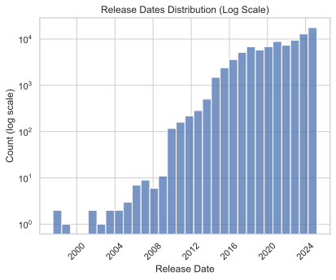
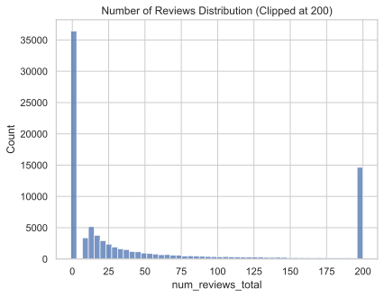
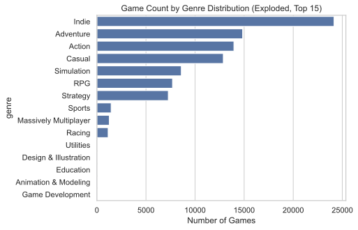
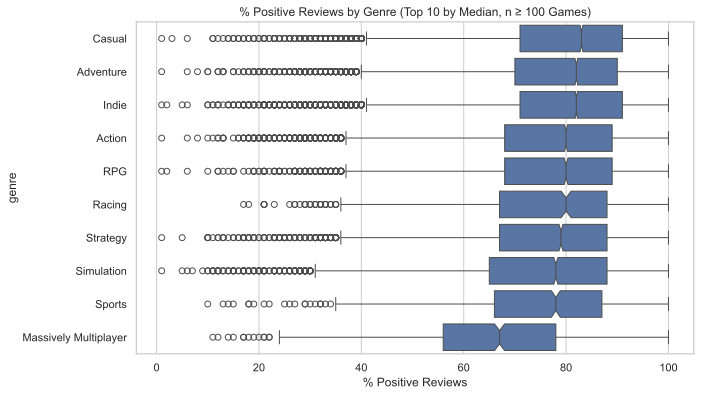
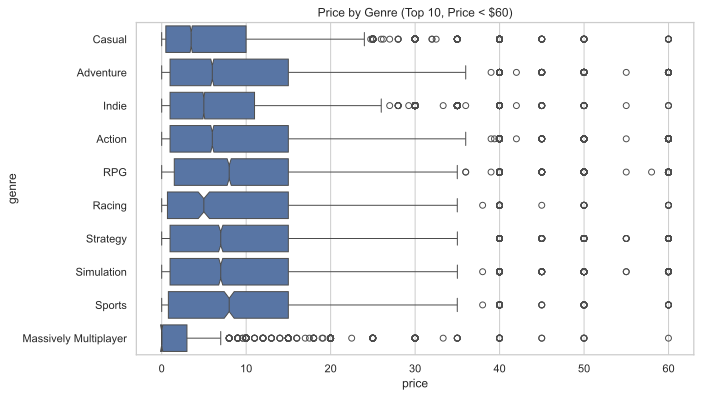
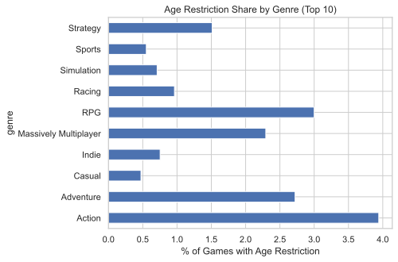
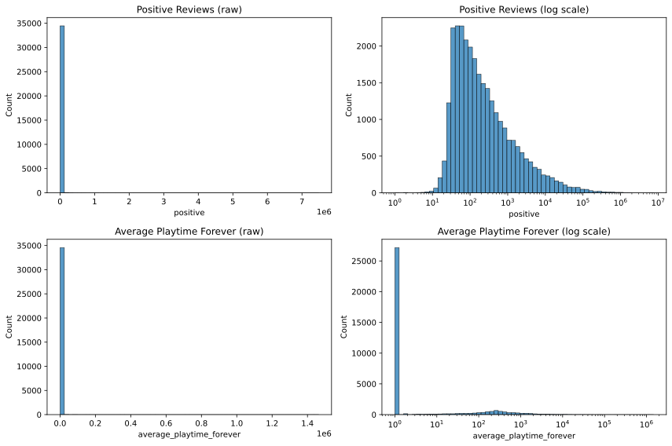
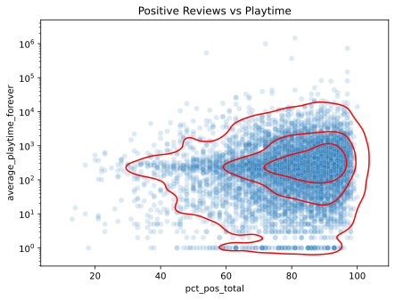

+---------------------------------------------------------------+--------------+
| **Section**                                                   | **Page**     |
+---------------------------------------------------------------+--------------+
| 1.  **Background**                                            | **2**        |
+---------------------------------------------------------------+--------------+
| a.  **Data Types and Structure**                              | **2**        |
+---------------------------------------------------------------+--------------+
| b.  **Variable Selection and Data Cleaning**                  | **3**        |
+---------------------------------------------------------------+--------------+
| c.  **Completeness and Data Quality**                         | **3**        |
+---------------------------------------------------------------+--------------+
| 2.  **Ethics, Privacy and Security**                          | **4**        |
+---------------------------------------------------------------+--------------+
| 3.  **Exploratory Data Analysis**                             | **5**        |
+---------------------------------------------------------------+--------------+
| a.  **Scoping Data**                                          | **5**        |
+---------------------------------------------------------------+--------------+
| b.  **Genre Distribution**                                    | **6**        |
+---------------------------------------------------------------+--------------+
| c.  **Positive Reviews Distribution**                         | **6**        |
+---------------------------------------------------------------+--------------+
| d.  **Confounders (Price and Age by Genre)**                  | **7**        |
+---------------------------------------------------------------+--------------+
| e.  **Distribution of Positive Reviews and Average Playtime** | **8**        |
+---------------------------------------------------------------+--------------+
| f.  **Price and Success**                                     | **8**        |
+---------------------------------------------------------------+--------------+
| g.  **Price and Positive Reviews**                            | **8**        |
+---------------------------------------------------------------+--------------+
| 4.  **Individual Contributions**                              | **9**        |
+---------------------------------------------------------------+--------------+
| 5.  **Whats Next?**                                           | **10**       |
+---------------------------------------------------------------+--------------+
| 6.  **References**                                            | **10**       |
+---------------------------------------------------------------+--------------+
| 7.  **Appendix A (Project Timeline)**                         | **11**       |
+---------------------------------------------------------------+--------------+
| 8.  **Appendix B (Task Allocation)**                          | **11**       |
+---------------------------------------------------------------+--------------+
| 9.  **Appendix C (Detailed Data Description)**                | **12**       |
+---------------------------------------------------------------+--------------+

\newpage

## 1. Background

Our group worked on the Steam Games Dataset published on Kaggle by Artemiy Ermilov and collaborators. The dataset contains information about available games found on the Steam library which is one of the largest digital distribution platforms of PC games. The dataset leads up to March 2025 and contains information on more than 90,000 games. The authors provide both a raw dataset and cleaned version removing duplicate entries and playtest versions of games (playtest games are incomplete versions that are given to testers in order to give feedback to the developers before the final game is released). While a May 2024 dataset is also available, we decided to focus our analysis on the March 2025 data alone.

The version of the dataset used in our analysis is the cleaned 2025 version that contains 89,618 observations and 47 variables. It provides information about individual games and includes attributes relating to their release, pricing, genres, developers, publishers, user reviews, supported platforms and more. Each observation represents a game found on Steam, while the columns are different attributes of that game. This dataset is of interest because it provides an opportunity to investigate patterns in the video game industry and explore factors associated with the popularity and success of games. Steam contains a wide variety of games of differing distinct characteristics. Therefore, analyzing these characteristics will provide an opportunity to discern whether they can be associated with greater success of a game.  The dataset can be used to explore questions like whether some genres are more successful than others, whether the price of a game is associated with its popularity and whether characteristics such as release year or developer are related to the number of positive reviews a game receives. These questions allow us to use exploratory data analysis to identify patterns and relationships within the dataset rather than focusing on a single type of game.

### **1a. Data Types and Structure**

The dataset contains a mixture of numerical, categorical, date and text based variables. Numerical variables include measures such as game price and review related statistics. Categorical variables describe characteristics such as the game’s genre, developer, publisher and supported platforms. The dataset also contains date information including game release dates which allows games to be compared across different periods. Each row represents one game rather than a repeated measurement over time meaning that the dataset is not a traditional time-series dataset. The release date variables allow trends in the number and characteristics of games to be investigated over time. Some variables can also contain multiple categories for a single game. For example, a game may fall under multiple different genres so this needs to be considered when summarising categorical variables.

\newpage

### **1b. Variable Selection and Data Cleaning**

Before conducting our analysis, we removed several variables that we thought were not relevant and would not provide useful information for our EDA. These included `header_image`, `website`, `support_url`, `support_email`, `metacritic_url`, `screenshots`, `movies`, `packages`, `detailed_description` and `about_the_game`. Variables containing URLs and emails won’t provide any insightful information pertaining to our analysis as they serve to redirect to outside sources. Variables that represent visual elements like images and videos won’t be used as we will focus on using numerical and text data for the analysis. There are three variables that contain descriptions of each game which have different amounts of text. For the purpose of simplicity, the short_description will be kept and the other two excluded. The packages variable consists of lists of additional content unique to each game, thus, removing the variable reduces unnecessary noise in the dataset. We also excluded score_rank due to its extremely high number of missing data. Of the 89,618 games in the dataset, 89,579 games had no score rank recorded which makes up 99% of games in the dataset. This leaves only 39 observations with available values. Including this variable would provide very limited information and could substantially reduce the number of observations available for analyses involving it.

### **1c. Completeness and Data quality**

We assessed the completeness of the dataset by examining missing values and duplicate observations. The dataset contains 89,618 rows and 47 columns and no duplicate rows, we also found that substantial amounts of missing data were present in some variables. 

The reviews variable contains 79,217 missing values, representing 88.39% of observations. The high proportion of missing review data is important when using reviews as an indicator of game popularity as analyses based on this variable may represent only a subset of the games in the dataset. Approximately 10,401 games have recorded review information, meaning that conclusions involving reviews need to be interpreted with this limitation in mind. Missing data was considered when selecting variables for analysis and interpreting results. Rather than assuming that missing values represented zero, missing observations were treated as unavailable information unless there was a clear reason to interpret them otherwise.  As no duplicate rows were identified, duplicate observations did not require removal during the data cleaning process Other similar data preparation steps were performed when necessary to ensure that variables were in suitable formats for analysis. Because our analysis is solely focused on the Steam Games Dataset, no integration of multiple datasets was required.

\newpage

## **2. Ethics, Privacy and Security**

When looking into ethical considerations of using any dataset for data analysis, we must always check how the data was collected. According to kaggle, who hosts the Steam games 2025 dataset, the data was collected directly from scraping the Steam store page, the Steam API and public user metrics (reviews, scores etc.), which all fall under publicly available information. Therefore, there are few ethical concerns when it comes to the data collection process. 

The Steam games dataset also uses plenty of copyrighted material and intellectual properties. This includes game titles, descriptions, screenshots from the games, artwork and reviews. While artwork and screenshots will likely not be used during the analysis, we may utilize material like descriptions and reviews. Thus, we will keep in mind to use these materials strictly for analysis and we will not republish them in any way.

Another ethical concern is inherent bias within the dataset, in particular, when using variables such as reviews and scores in the analysis. In most cases, a large number of people who buy games often don’t bother to give a rating and an even smaller minority are vocal enough to write a review. Thus, these metrics are not indicative of the whole population of players who own any particular and in some cases, skew the reality of how people perceive a game. Furthermore, there is also bias linked to the differing popularity of games on Steam. Games with larger playerbases will always have more data than lesser known games. Additionally, those more niche games potentially have dedicated communities which may skew results.

A major ethical concern in this project is the privacy of the Steam users in the dataset. While personal information from Steam users accounts isn’t part of any variable within the dataset, we cannot ignore the likelihood of users including personal information in their submitted reviews. Our analysis project does not necessitate the use of such private information. Therefore, when this information does come up, we will do our best to ignore or omit them during our analysis and model building. To keep our project and results secure, we will maintain all the details within group members and our supervisors. Our reports will be done on a Google docs that has access restricted to group members and supervisors. Discussions about the project are held within private group chats and meetings. The codes and resources used will remain within the access restricted to the group.

\newpage

## 3. Exploratory Data Analysis

#### 3a. Scoping Data

Our dataset covers games released on Steam from April 1997 to March 2025. The majority of games in the dataset were released after 2016. Figure 1 uses a log scale on the count axis. Without this, the small counts before 2010 look like zero next to the 2024 peak. The log scale makes the early years visible, but it also compresses the visual gap between years. Bar height alone should not be used to compare counts. Exact values should be read from the axis.

{fig-align="center" width="400"}

**Figure 1:** Distribution of game release dates in the cleaned Steam dataset, count axis on log

Before further analysis, we filtered out games with fewer than 30 reviews. Steam sets both `pct_pos_total` and `num_reviews_total` to -1 for games with fewer than 10 reviews. At 10 reviews, one review can swing `pct_pos_total` by about 10 points. This is too noisy to trust. Figure 2 shows the distribution of review counts, clipped at 200 for readability. Most games sit at the low end of this range, which is why a cutoff matters. A 30 review cutoff keeps a large sample while reducing this noise. This leaves 34,583 games out of 89,618, or 38.6% for remaining analysis.

{fig-align="center" width="400"}

**Figure 2:** Distribution of total review counts, clipped at 200 reviews for readability

\newpage

#### 3b. Genre Distribution

The genres column lists every genre for a game. Most games have more than one genre. We use the review-filtered dataset described above, and drop a further 109 games with no genre listed. The column also includes labels that are not genres, such as "Violent", "Gore", "Nudity", "Sexual Content", "Free To Play" and "Early Access". We remove these six before counting genres, which drops the number of unique labels from 27 to 21. Figure 3 shows the count of games for the top 15 genres. Indie is the most common at 24,155 games, followed by Adventure and Action with 14,844 and 13,953. The smallest genres in this list have only a few hundred games each. This plot only counts genre labels, not unique games, since a game with three genres is counted three times. It does not show how positive reviews vary within a genre, which is why a minimum size cutoff is applied before that comparison.

{fig-align="center" width="400"}

**Figure 3:** Number of games per genre, top 15 genres (exploded, review-filtered dataset)

#### 3c. **Positive Reviews Distribution**

The pct_pos_total variable is the percentage of positive reviews for a game. We set a minimum size of 100 games per genre before comparing review scores. Without a cutoff, a single game in a small tag could push its median to 100% or 0% and rank it above established genres like Action or RPG. This cutoff removes every software tag and keeps the 10 significant game genres shown in Figure 4. Casual has the highest median at 83%, and Massively Multiplayer has the lowest at 67%. The boxes are notched, showing the confidence interval around each median. Where notches overlap, the difference between two genres' medians is not reliable. Where they don't overlap, as with Casual and Massively Multiplayer, the gap is more trustworthy. The plot does not show how many games sit in each genre, so pair it with the n ≥ 100 filter to avoid assuming equal representation.

{fig-align="center" width="400"}

**Figure 4:** Percentage of positive reviews by genre, top 10 genres with at least 100 games

#### 3d. Confounders (Price and Age by Genre)

The price variable is the base price of a game in US dollars, and required_age is the minimum age rating Steam sets for a game. Figure 5 shows the price spread for each genre, with notches marking the confidence interval around each median. Sports and RPG have the highest median price at \$7.99, while Massively Multiplayer sits close to \$0 since most of these games are free to play. Figure 6 shows the share of games with an age restriction in each genre. Action has the highest share at 3.9%, compared to 0.5% for Casual. This pattern lines up with the review score chart in reverse. Genres with a higher price and a higher age-restriction share tend to have a lower median pct_pos_total. These two plots show price and age separately by genre. They do not show whether the same games drive both patterns within a genre, only that the genre-level trends move together. This supports the plan to control for both price and age when we study the link between genre and review positivity.

{fig-align="center" width="400"}

**Figure 5:** Base price (USD) by genre, top 10 genres, games priced under \$60

{fig-align="center" width="400"}

**Figure 6:** Share of games with an age restriction, by genre, top 10 genres

### **Distribution of Positive Reviews & Average play timec**

The `average_playtime_forever` variable is the average number of minutes players have spent in a game since it launched on Steam. The `pct_pos_total` variable measures the percentage of positive reviews. Figure 7 plots these two variables for 34,583 games with 30 or more reviews. `pct_pos_total` ranges from about 13% to 100% in this sample, with most games sitting between 50% and 100% positive. `average_playtime_forever` spans a wide range from 0 minutes up to over a million minutes, so we plot it on a log scale to see the spread clearly. 78.5% of games in our filtered dataset have an average playtime of 0. This is not limited to games near our review cutoff: among these games, review counts range from 30 up to over 2.5 million, with a median of 102. This suggests Steam does not record or report playtime data for every game, so we treat this as a limitation rather than a reason to filter these games out.

{fig-align="center" width="550"}

**Figure 7:** Positive reviews and Average playtime in log scale

{fig-align="center" width="400"}

**Figure 8:** Average playtime (minutes, log scale) versus percentage of positive reviews
